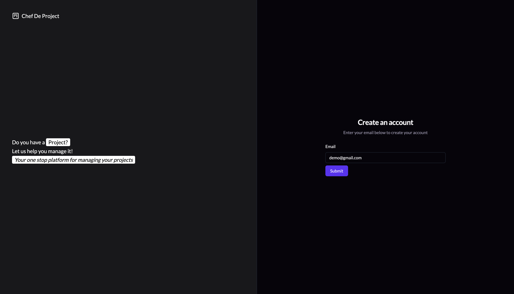
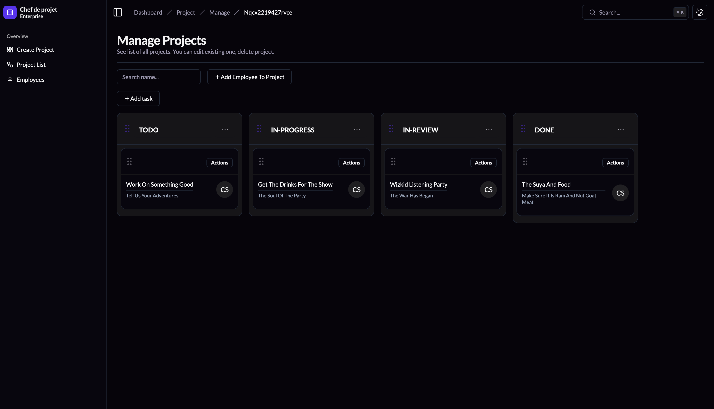

# Project Manager

I built this basic project manager tool to help me manager my projects. You can create a project, manage the activities within the project, assign employees to work on the activities e.t.c.


## Screenshots






## Run Locally

Clone the project

```bash
  git clone https://link-to-project
```

Go to the project directory

```bash
  cd my-project
```

Install dependencies

```bash
  npm install
```

Start the server

```bash
  npm run dev
```


